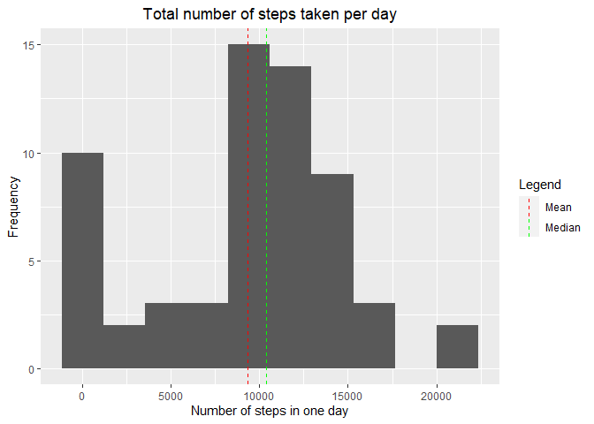

#### Libraries

```r
library(dplyr)
library(lubridate)
library(ggplot2)
```

## Loading and preprocessing the data

```r
unzip('activity.zip')
activity <- read.csv('activity.csv') %>%
  mutate(date = as_date(date))

head(activity)
```

```
##   steps       date interval
## 1    NA 2012-10-01        0
## 2    NA 2012-10-01        5
## 3    NA 2012-10-01       10
## 4    NA 2012-10-01       15
## 5    NA 2012-10-01       20
## 6    NA 2012-10-01       25
```

## What is mean total number of steps taken per day?

```r
# Getting the total number of steps of each day
steps_by_date <- activity %>%
  group_by(date) %>%
  summarise(steps = sum(steps, na.rm = TRUE), .groups = "drop")

# Creating the histogram
ggplot(steps_by_date, aes(x = steps)) +
  geom_histogram(bins = 10) +
  geom_vline(aes(xintercept = mean(steps), color = "Mean"),
             linetype = "dashed") +
  geom_vline(aes(xintercept = median(steps), color = "Median"),
             linetype = "dashed")+
  labs(x = "Number of steps in one day",
       y = "Frequency",
       title = "Total number of steps taken per day") + 
  theme(plot.title = element_text(hjust = 0.5)) +
  scale_color_manual(name = "Legend", 
                     values = c(Median = "green", Mean = "red"))
```

<!-- -->

```r
# Mean and median in console
message("Mean: ", mean(steps_by_date$steps), 
        "\nMedian: ", median(steps_by_date$steps))
```

```
## Mean: 9354.22950819672
## Median: 10395
```

## What is the average daily activity pattern?

```r
#The average number of steps taken, averaged across all days 
mean_steps_interval <- activity %>%
  select(interval, steps) %>%
  group_by(interval) %>%
  summarise(steps = mean(steps, na.rm = TRUE), .groups = "drop")

# Time series plot
ggplot(mean_steps_interval, aes(x = interval, y = steps)) +
  geom_line() +
  labs(x = "5-minute interval",
       y = "average number of steps",
       title = "Average daily activity pattern") +
  theme(plot.title = element_text(hjust = 0.5))
```

<!-- -->

```r
# Which 5-minute interval, on average across all the days in the dataset, contains the maximum number of steps?
max_avg_steps <- mean_steps_interval %>%
  filter(steps == max(steps)) %>%
  select(interval) %>%
  pull()
message("5-minute interval with max average of steps: ", max_avg_steps)
```

```
## 5-minute interval with max average of steps: 835
```

## Imputing missing values

```r
# Total number of missing values in the dataset
total_na <- apply(is.na(activity), 2, sum) %>%
  sum()
message("Total NA's: ", total_na)
```

```
## Total NA's: 2304
```

```r
# Devise a strategy for filling in all of the missing values in the dataset.
# Strategy: replace NA's with the mean for that 5-minute interval
missing_data <- activity %>%
  filter(is.na(.)) %>%
  select(-steps) %>%
  inner_join(mean_steps_interval, by = "interval")
head(missing_data)
```

```
##         date interval     steps
## 1 2012-10-01        0 1.7169811
## 2 2012-10-01        5 0.3396226
## 3 2012-10-01       10 0.1320755
## 4 2012-10-01       15 0.1509434
## 5 2012-10-01       20 0.0754717
## 6 2012-10-01       25 2.0943396
```

```r
## Create a new dataset that is equal to the original dataset but with the missing data filled in
clean_activity <- activity
clean_activity$steps[is.na(clean_activity$steps)] <- missing_data$steps
head(clean_activity)
```

```
##       steps       date interval
## 1 1.7169811 2012-10-01        0
## 2 0.3396226 2012-10-01        5
## 3 0.1320755 2012-10-01       10
## 4 0.1509434 2012-10-01       15
## 5 0.0754717 2012-10-01       20
## 6 2.0943396 2012-10-01       25
```

```r
# Make a histogram of the total number of steps taken each day and Calculate 
# and report the mean and median total number of steps taken per day. Do these 
# values differ from the estimates from the first part of the assignment? What 
# is the impact of imputing missing data on the estimates of the total daily 
# number of steps?
clean_steps_by_date <- clean_activity %>%
  group_by(date) %>%
  summarise(steps = sum(steps, na.rm = TRUE), .groups = "drop")

ggplot(clean_steps_by_date, aes(x = steps)) +
  geom_histogram(bins = 10) +
  geom_vline(aes(xintercept = mean(steps), color = "Mean")) +
  geom_vline(aes(xintercept = median(steps), color = "Median"),
             linetype = "dashed")+
  labs(x = "Number of steps in one day",
       y = "Frequency",
       title = "Total number of steps taken per day") + 
  theme(plot.title = element_text(hjust = 0.5)) +
  scale_color_manual(name = "Legend", 
                     values = c(Median = "green", Mean = "red"))
```

<!-- -->

```r
# Mean and median in console
# The mean and median are different from the first plot after cleaning the 
# data, as both now have the same value
message("Mean: ", mean(clean_steps_by_date$steps), 
        "\nMedian: ", median(clean_steps_by_date$steps))
```

```
## Mean: 10766.1886792453
## Median: 10766.1886792453
```

## Are there differences in activity patterns between weekdays and weekends?
